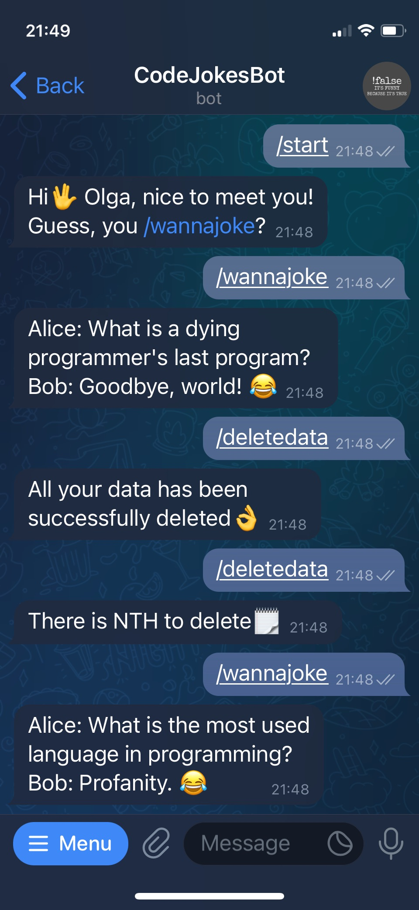

**ABOUT**

This telegram bot sends jokes from third-party API to user upon request.

A short representation of the bot:


**RUN**

First of all you are to set your environment variables (telegram bot token can be configured by `@BotFather`): 
```
export TELEGRAM_JOKESBOT_TOKEN=your_token
export PROJECTS_DB_USERNAME=your_username
export PROJECTS_DB_PASSWORD=your-password
```
Then you can run the app:
`mvn spring-boot:run` or
`docker compose up`

**TOOLS**

Java 17, SpringBoot 3, Spring Data, Maven, PostgreSQL, FeignClient, Docker 

**LICENSE**

Licensed under the MIT license.


